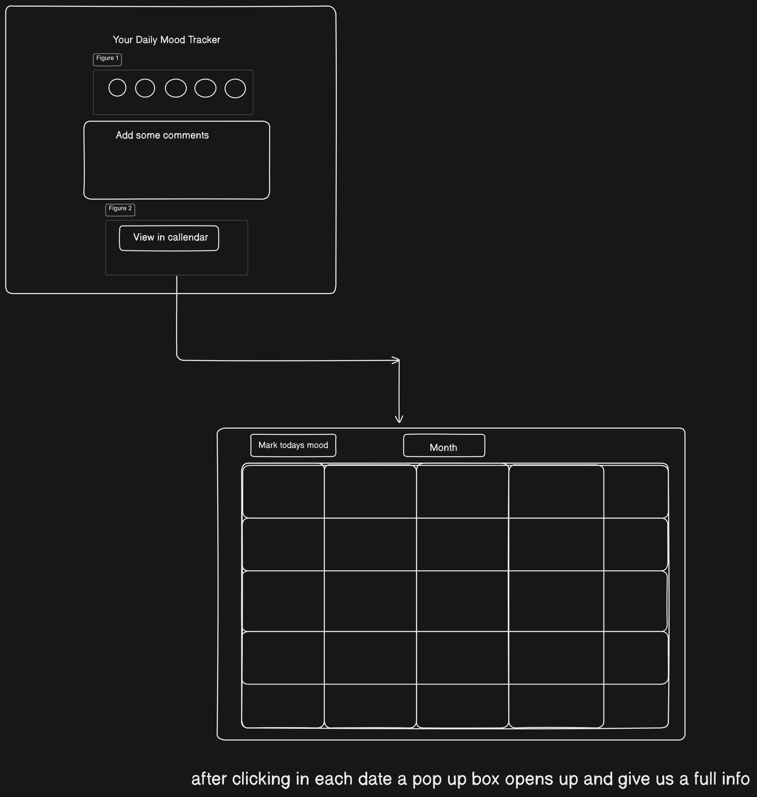

# Daily Mood Tracker

## Application Features

- **Emoji-based Mood Selection**: Users can select their mood using a variety of emoji options.
- **Storing the data**: Storing the data in local storage so that it doesnt wipe out when hits refresh.
- **Comment Section**: Allows users to add comments about their day.
- **Calendar View**: Displays moods on selected dates for easy tracking.
- **Dark Mode & Light Mode**: Toggle between dark and light themes.
- **Mood Modal**: Clicking on a date shows a modal with the saved mood and comments.
- **User-Friendly UI**: Simple and intuitive design with smooth transitions.

## Screenshots

### Initial design of site

### Mood Selection Page


### Calendar View


### Full Event


## Deployment Link

[Live Demo](https://aj-mood-tracker.netlify.app/)

## How to Run Locally

1. Clone the repository:
   ```sh
   git clone https://github.com/AJTITAN/daily-mood-tracker.git
   ```
2. Open `index.html` in your browser:
   ```sh
   open index.html
   ```

## Technologies Used

- **HTML** for structure
- **CSS** for styling (including dark mode support)
- **JavaScript** for interactivity (calendar, theme toggle, modal display)

## Future Improvements

- **User Authentication**: Allow users to login and keep thier moods private.
- **Backend Integration**: Store mood history in a database instead of local storage.
- **Analytics & Reports**: Generate insights based on mood trends with AI.

